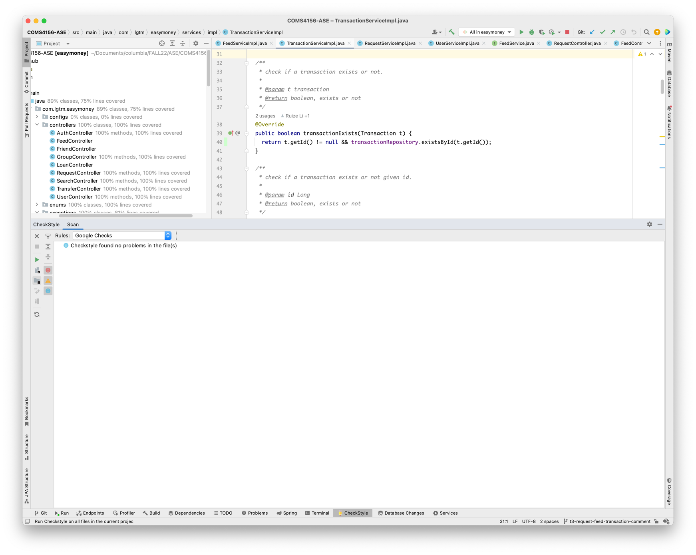

# COMS W4156 ASE Project

## Team members

Junhao Lin, Ruize Li, Ken Xiong, Jianyang Duan
## Client Repo (Second Iteration)
[Link to our second iteration Client repository](https://github.com/rl3250/f22_4156_client) 
We decide to demo personal user related use case, i.e. personal end users can view the feed, make money requests/transfers to someone
else, and update their user profile. You can think of venmo/zelle as a real-life example.

## How to view CI/CD Reports

We set up Github Actions and run all tests(unit tests, controllers, services, integrations, data integrity, multi-clients) using Junit with Jacoco
coverage report. The actions workflow will create two badges, as shown at the very top of the Readme: one is showing the `branch` coverages, and the other one
is the `overall` coverage.

To manually run the coverage, you can use Intellij client to open this repo, and configure Jacoco coverage report, and `run all tests with coverage`.

## How to build and run locally

1. Install [JDK 17](https://www.oracle.com/java/technologies/javase/jdk17-archive-downloads.html) and MySQL server (version >= 8)
2. Create a schema named "4156db" in your local MySQL server
3. Enter the username and the password of your local MySQL server in [src/main/resources/application.properties](src/main/resources/application.properties)
4. By default, the service runs on port 8080. If you wish to use a different port, enter `server.port=<port no.>` in [src/main/resources/application.properties](src/main/resources/application.properties)
5. Run `./mvnw`
6. Run `java -jar ./target/easymoney-0.0.1-SNAPSHOT.war`

## How to run multi-client system tests with Postman

1. Restart the application, or manually clear all entries in your local database.
2. Open [Postman web](https://web.postman.co/) and go to your workspace
3. Select "Collections" on the left, and then click "Import"
4. Click "Upload files", select [system_tests.postman_collection.json](system_tests.postman_collection.json) in this repository, and click "Import"
5. Once the collection is imported to your workspace, take a look at the test requests within:
   - Create different types of users
   - Deposit money
   - Create, accept, decline and retrieve money requests
   - Create a group with different types of users 
   - Personal users can get a list of ads from the business users within the same group
   - Get user profiles by id or search text
   - Add and accept friendship (only available to personal users)
   - Get personal feed which includes friend activities
   - Create, accept, decline and retrieve loan requests (a loan request must be from a personal user to a financial user)
6. Before you can execute the test requests, you may need to install Postman desktop agent. Just follow the instructions from Postman.
7. Execute the test requests IN ORDER. You should observe that the HTTP status codes will be either 200 or 201, and the response bodies (sometimes empty because our client implementation will check HTTP status code first).
8. If you'd like to rerun all the test requests, redo step 1.

## How to run unit and integration tests

1. Create a schema named "4156dbtest" in your local MySQL server
2. Enter the username and the password of your local MySQL server in [src/test/resources/application.properties](src/test/resources/application.properties)
3. By default, the service runs on port 8080. If you wish to use a different port, enter `server.port=<port no.>` in [src/test/resources/application.properties](src/test/resources/application.properties)
4. Install Maven (>=3.8.6 recommended) if you haven't done so
5. Run `mvn clean test`

## API Documentation

You can view an online version [here](https://app.swaggerhub.com/apis-docs/LHUN1660_1/COMS-W4156-Service).

Alternatively, if you'd like to see immediate documentation update after you change the local code: [Run the service locally](#how-to-build-and-run-locally), and then open your browser. The API documentation can be viewed in 3 ways (change the port below if needed):
1. UI (recommended): http://localhost:8080/swagger-ui/index.html
2. JSON: http://localhost:8080/api-docs
3. Download the YAML: http://localhost:8080/api-docs.yaml

## Third-party code in use

These are mostly defined in `pom.xml` and downloaded by Maven.

- Spring: Handles client requests, returns responses to clients, and manages beans. Used everywhere.
- Spring validation: Validates data fields in client requests. Mainly used in [src/main/java/com/lgtm/easymoney/models](src/main/java/com/lgtm/easymoney/models).
- JPA: Interacts with the database. Mainly used under [src/main/java/com/lgtm/easymoney/repositories](src/main/java/com/lgtm/easymoney/repositories).
- lombok: Simplifies the code by avoiding manually writing getters, setters, etc. Mainly used in [src/main/java/com/lgtm/easymoney/models](src/main/java/com/lgtm/easymoney/models) and [src/main/java/com/lgtm/easymoney/payload](src/main/java/com/lgtm/easymoney/payload).

We also utilized Spring Security and the JWT implementation from https://github.com/isopropylcyanide/Jwt-Spring-Security-JPA/tree/master/src/main/java/com/accolite/pru/health/AuthApp/security which is in [src/main/java/com/lgtm/easymoney/security](src/main/java/com/lgtm/easymoney/security).

## Style checker

We follow style rules of Google checks. You may see warnings/errors if you run style checking with other configs.
Below is the screenshot for checking entire project using `checkstyle` plugin from intellij, no errors occured.

## Deployment

Our service is hosted on <http://easymoneytest-env.eba-gxycxg4j.us-east-1.elasticbeanstalk.com/>.

This repo also includes a [collection of Postman test requests for the deployed service](remote_server_system_tests.postman_collection.json). You can import it to your Postman workspace by following steps 2-4 of [the instructions above](#how-to-run-multi-client-system-tests-with-postman), but keep in mind that these are just API invocation examples. Before sending requests to the remote server, many of the request parameters need to be modified as the remote database may already contain relevant records.
